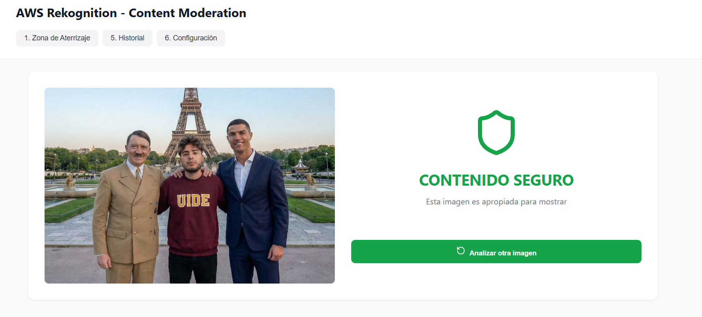
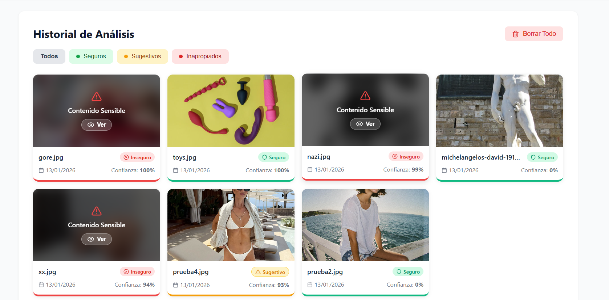

# Factum AI

**Sistema de Moderación de Contenido Multimedia con Inteligencia Artificial**

## Stack Tecnológico

### Frontend
- **React** 18.x con TypeScript
- **Vite** como bundler y dev server
- **Tailwind CSS** para estilos
- **AWS SDK** para integración con servicios AWS

### Backend
- **AWS Lambda** (Node.js 18.x)
- **Amazon S3** para almacenamiento de imágenes
- **Amazon Rekognition** para análisis de contenido
- **API Gateway** para endpoints REST

---

## Requisitos Previos

Antes de comenzar, asegúrate de tener instalado:

- **Node.js** versión 18.0.0 o superior
- **npm** versión 9.0.0 o superior
- **Cuenta AWS** activa con permisos para:
  - Amazon S3
  - AWS Lambda
  - Amazon API Gateway
  - Amazon Rekognition

---

## Instalación

### 1. Clonar el Repositorio

```bash
git clone https://github.com/T0NY24/Factum-AI.git
cd Factum-AI
```

### 2. Configurar Frontend

```bash
cd factum-app
npm install
```

### 3. Configurar Variables de Entorno

Crea un archivo `.env` en la carpeta `factum-app/`:

```env
# API Gateway Endpoint (sin barra al final)
VITE_API_GATEWAY_URL=https://tu-api-id.execute-api.us-east-2.amazonaws.com/prod

# Región de AWS
VITE_AWS_REGION=us-east-2

# Bucket S3
VITE_S3_BUCKET_NAME=nombre-de-tu-bucket
```

**Importante**: Configura los servicios de AWS antes de ejecutar la aplicación. Consulta la [guía de configuración AWS](docs/AWS_SETUP.md) para instrucciones detalladas.

### 4. Configurar Funciones Lambda

```bash
# Lambda: Generador de URLs Pre-firmadas
cd lambda/get-presigned-url
npm install

# Lambda: Moderación de Imágenes
cd ../moderate-image
npm install
```

---

## Ejecución en Desarrollo

```bash
cd factum-app
npm run dev
```

La aplicación estará disponible en `http://localhost:5173`

### Scripts Disponibles

```bash
npm run dev      # Inicia servidor de desarrollo
npm run build    # Compila para producción
npm run preview  # Previsualiza build de producción
npm run lint     # Ejecuta linter
```

---

## Capturas de Pantalla

<table>
  <tr>
    <td align="center">
      
      <br />
      <strong>Carga de Imágenes</strong>
    </td>
    <td align="center">
      
      <br />
      <strong>Historial de Análisis</strong>
    </td>
  </tr>
</table>

---


## Documentación Adicional

- **[AGENTS.MD](factum-app/AGENTS.MD)** - Documentación técnica detallada del proyecto
- **[API Reference](docs/API_REFERENCE.md)** - Documentación de endpoints
- **[Architecture](docs/ARCHITECTURE.md)** - Diagrama de arquitectura del sistema

---


