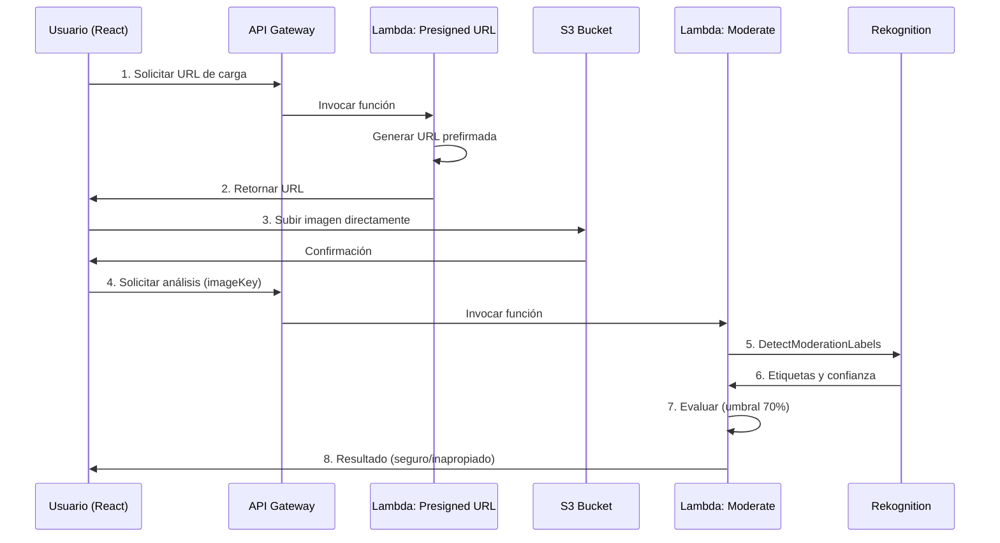

# Factum AI - Sistema de Moderación de Contenido

Sistema de clasificación inteligente de contenido multimedia utilizando React.js y AWS (Rekognition, Lambda, S3, API Gateway) para detectar contenido inapropiado en imágenes.

## 🎯 Características

- ✨ **Interfaz moderna** con diseño premium y animaciones fluidas
- 🎯 **Detección inteligente** de contenido inapropiado usando Amazon Rekognition
- ⚡ **Procesamiento en tiempo real** con feedback visual
- 🔒 **Seguro y escalable** utilizando servicios de AWS
- 📊 **Resultados detallados** con niveles de confianza y etiquetas

## 🏗️ Arquitectura



## 📁 Estructura del Proyecto

```
Factum-AI/
├── factum-app/                 # Aplicación React
│   ├── src/
│   │   ├── components/
│   │   │   ├── ImageUploader.jsx      # Componente de carga
│   │   │   ├── ImageUploader.css
│   │   │   ├── ModerationResult.jsx   # Componente de resultados
│   │   │   └── ModerationResult.css
│   │   ├── services/
│   │   │   └── apiService.js          # Llamadas a API Gateway
│   │   ├── App.jsx                    # Componente principal
│   │   ├── App.css
│   │   └── index.css
│   ├── .env.example
│   └── package.json
│
├── lambda/                     # Funciones AWS Lambda
│   ├── get-presigned-url/
│   │   ├── index.js                   # Generar URL S3
│   │   └── package.json
│   └── moderate-image/
│       ├── index.js                   # Análisis con Rekognition
│       └── package.json
│
└── docs/
    └── AWS_SETUP.md                   # Guía de configuración AWS
```

## 🚀 Inicio Rápido

### Prerrequisitos

- Node.js 18+ y npm
- Cuenta de AWS con acceso a:
  - S3
  - Lambda
  - API Gateway
  - Rekognition
- AWS CLI configurado (opcional pero recomendado)

### 1. Clonar e Instalar

```bash
# Clonar el repositorio
git clone https://github.com/T0NY24/Factum-AI.git
cd Factum-AI

# Instalar dependencias del frontend
cd factum-app
npm install
```

### 2. Configurar AWS

Sigue la guía completa en [docs/AWS_SETUP.md](docs/AWS_SETUP.md) para:

1. Crear bucket S3
2. Desplegar funciones Lambda
3. Configurar API Gateway
4. Establecer permisos IAM

### 3. Configurar Variables de Entorno

```bash
# En factum-app/
cp .env.example .env
```

Edita `.env` con tus valores:

```env
VITE_API_GATEWAY_URL=https://tu-api-id.execute-api.us-east-1.amazonaws.com/prod
VITE_AWS_REGION=us-east-1
VITE_S3_BUCKET_NAME=tu-bucket-name
```

### 4. Ejecutar la Aplicación

```bash
# En factum-app/
npm run dev
```

Abre [http://localhost:5173](http://localhost:5173) en tu navegador.

## 🔧 Desarrollo

### Scripts Disponibles

```bash
npm run dev      # Iniciar servidor de desarrollo
npm run build    # Construir para producción
npm run preview  # Previsualizar build de producción
npm run lint     # Ejecutar linter
```

### Desplegar Funciones Lambda

```bash
# Para get-presigned-url
cd lambda/get-presigned-url
npm install
zip -r function.zip .
# Subir a AWS Lambda desde la consola

# Para moderate-image
cd lambda/moderate-image
npm install
zip -r function.zip .
# Subir a AWS Lambda desde la consola
```

## 📖 Uso

1. **Cargar Imagen**: Arrastra una imagen o haz click para seleccionar
2. **Subir a S3**: La imagen se sube automáticamente usando URL prefirmada
3. **Análisis**: Amazon Rekognition analiza el contenido
4. **Resultado**: Recibes feedback visual sobre si la imagen es apropiada o no

### Criterios de Moderación

- **Umbral de confianza**: 70%
- **Categorías detectadas**:
  - Desnudez explícita
  - Actividad sexual
  - Contenido gráfico
  - Y más categorías de moderación de AWS

## 🎨 Tecnologías

### Frontend
- **React 19** - Biblioteca de UI
- **Vite** - Build tool y dev server
- **React Dropzone** - Drag & drop de archivos
- **Axios** - Cliente HTTP
- **AWS SDK v3** - Integración con S3

### Backend (AWS)
- **S3** - Almacenamiento de imágenes
- **Lambda** - Procesamiento serverless
- **API Gateway** - Endpoints REST
- **Rekognition** - Detección de contenido inapropiado
- **CloudWatch** - Logs y monitoreo
- **IAM** - Gestión de permisos

## 🔒 Seguridad

- ✅ URLs prefirmadas con expiración (5 minutos)
- ✅ CORS configurado correctamente
- ✅ Validación de tipos de archivo
- ✅ Límite de tamaño de archivo (10MB)
- ✅ Políticas IAM de mínimo privilegio
- ✅ Lifecycle policy para eliminar archivos antiguos

## 💰 Costos Estimados

Para uso moderado (~10,000 imágenes/mes):

| Servicio | Costo Mensual |
|----------|---------------|
| S3 | $0.50 - $2.00 |
| Lambda | $1.00 - $3.00 |
| API Gateway | $3.50 |
| Rekognition | $10.00 |
| **Total** | **~$15 - $20/mes** |

> Nota: Los primeros 12 meses tienen nivel gratuito significativo

## 🐛 Troubleshooting

### Error: "Cannot read properties of undefined"
- Verifica que las variables de entorno estén configuradas
- Confirma que API Gateway esté desplegado

### Error: "CORS policy"
- Verifica configuración CORS en S3
- Confirma configuración CORS en API Gateway

### Error: "Access Denied"
- Revisa permisos IAM de las funciones Lambda
- Confirma que el bucket S3 exista

Para más ayuda, consulta [docs/AWS_SETUP.md](docs/AWS_SETUP.md#troubleshooting)

## 📝 Licencia

Este proyecto es de código abierto y está disponible bajo la licencia MIT.

## 👨‍💻 Autor

**T0NY24** - [GitHub](https://github.com/T0NY24)

## 🙏 Agradecimientos

- Amazon Web Services por los servicios cloud
- React y Vite por las increíbles herramientas de desarrollo
- La comunidad de código abierto

---

**⚠️ Nota**: Este es un proyecto educativo. Para uso en producción, considera implementar autenticación adicional, límites de tasa, y políticas de seguridad más estrictas.
