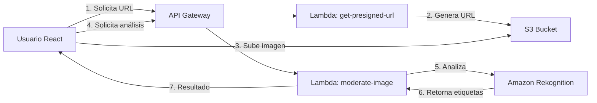

# Configuración de AWS - Factum AI

Guía completa para configurar los servicios de AWS necesarios para el sistema de moderación de contenido.

## Arquitectura del Sistema



## 1. Crear Bucket S3

### Paso 1: Crear el Bucket

```bash
aws s3 mb s3://factum-content-moderation --region us-east-1
```

O desde la consola de AWS:
1. Ir a **S3** en la consola de AWS
2. Click en **Create bucket**
3. Nombre: `factum-content-moderation` (debe ser único globalmente)
4. Región: `us-east-1` (o tu región preferida)
5. **Desmarcar** "Block all public access" (solo para el bucket, las imágenes seguirán privadas)
6. Click en **Create bucket**

### Paso 2: Configurar CORS

Agregar la siguiente configuración CORS al bucket:

```json
[
    {
        "AllowedHeaders": ["*"],
        "AllowedMethods": ["PUT", "POST", "GET"],
        "AllowedOrigins": ["*"],
        "ExposeHeaders": ["ETag"],
        "MaxAgeSeconds": 3000
    }
]
```

Desde la consola:
1. Selecciona tu bucket
2. Ve a la pestaña **Permissions**
3. Scroll hasta **Cross-origin resource sharing (CORS)**
4. Click **Edit** y pega la configuración JSON

## 2. Crear Funciones Lambda

### Lambda 1: get-presigned-url

#### Crear la función:

```bash
cd lambda/get-presigned-url
npm install
zip -r function.zip .
```

Desde la consola de AWS:
1. Ir a **Lambda** → **Create function**
2. Nombre: `factum-get-presigned-url`
3. Runtime: **Node.js 20.x**
4. Architecture: **x86_64**
5. **Create function**

#### Subir el código:

1. Click en **Upload from** → **.zip file**
2. Selecciona `function.zip`
3. Click **Save**

#### Variables de entorno:

Ir a **Configuration** → **Environment variables** → **Edit**:

| Key | Value |
|-----|-------|
| `S3_BUCKET_NAME` | `factum-content-moderation` |
| `AWS_REGION` | `us-east-1` |

#### Permisos IAM:

Adjuntar política inline al rol de ejecución:

```json
{
    "Version": "2012-10-17",
    "Statement": [
        {
            "Effect": "Allow",
            "Action": [
                "s3:PutObject",
                "s3:PutObjectAcl"
            ],
            "Resource": "arn:aws:s3:::factum-content-moderation/*"
        }
    ]
}
```

---

### Lambda 2: moderate-image

#### Crear la función:

```bash
cd lambda/moderate-image
npm install
zip -r function.zip .
```

Desde la consola de AWS:
1. Ir a **Lambda** → **Create function**
2. Nombre: `factum-moderate-image`
3. Runtime: **Node.js 20.x**
4. Architecture: **x86_64**
5. **Create function**

#### Subir el código:

1. Click en **Upload from** → **.zip file**
2. Selecciona `function.zip`
3. Click **Save**

#### Variables de entorno:

| Key | Value |
|-----|-------|
| `S3_BUCKET_NAME` | `factum-content-moderation` |
| `AWS_REGION` | `us-east-1` |

#### Permisos IAM:

Adjuntar política inline al rol de ejecución:

```json
{
    "Version": "2012-10-17",
    "Statement": [
        {
            "Effect": "Allow",
            "Action": [
                "rekognition:DetectModerationLabels"
            ],
            "Resource": "*"
        },
        {
            "Effect": "Allow",
            "Action": [
                "s3:GetObject"
            ],
            "Resource": "arn:aws:s3:::factum-content-moderation/*"
        }
    ]
}
```

## 3. Configurar API Gateway

### Crear API REST:

1. Ir a **API Gateway** → **Create API**
2. Seleccionar **REST API** (no private)
3. Click **Build**
4. Protocol: **REST**
5. Nombre: `factum-content-moderation-api`
6. Endpoint Type: **Regional**
7. **Create API**

### Crear recursos y métodos:

#### Recurso 1: /presigned-url

1. Click **Actions** → **Create Resource**
2. Resource Name: `presigned-url`
3. **Create Resource**
4. Con `/presigned-url` seleccionado, click **Actions** → **Create Method** → **POST**
5. Integration type: **Lambda Function**
6. Lambda Function: `factum-get-presigned-url`
7. **Save** → **OK** (dar permisos)

#### Recurso 2: /moderate

1. Click **Actions** → **Create Resource**
2. Resource Name: `moderate`
3. **Create Resource**
4. Con `/moderate` seleccionado, click **Actions** → **Create Method** → **POST**
5. Integration type: **Lambda Function**
6. Lambda Function: `factum-moderate-image`
7. **Save** → **OK**

### Habilitar CORS:

Para cada recurso (`/presigned-url` y `/moderate`):

1. Selecciona el recurso
2. Click **Actions** → **Enable CORS**
3. Marca todas las opciones
4. **Enable CORS and replace existing CORS headers**

### Desplegar API:

1. Click **Actions** → **Deploy API**
2. Deployment stage: **[New Stage]**
3. Stage name: `prod`
4. **Deploy**
5. Copia la **Invoke URL** (ej: `https://xxxxx.execute-api.us-east-1.amazonaws.com/prod`)

## 4. Configurar Frontend

En tu aplicación React, crea un archivo `.env`:

```env
VITE_API_GATEWAY_URL=https://xxxxx.execute-api.us-east-1.amazonaws.com/prod
VITE_AWS_REGION=us-east-1
VITE_S3_BUCKET_NAME=factum-content-moderation
```

Reemplaza `xxxxx` con tu ID de API Gateway.

## 5. Probar el Sistema

### Método 1: Desde la aplicación React

```bash
cd factum-app
npm install
npm run dev
```

### Método 2: Probar Lambda directamente

Desde la consola de Lambda, usa estos eventos de prueba:

**Test get-presigned-url:**

```json
{
  "body": "{\"fileName\":\"test.jpg\",\"fileType\":\"image/jpeg\"}"
}
```

**Test moderate-image:**

```json
{
  "body": "{\"imageKey\":\"uploads/1234567890-test.jpg\"}"
}
```

## 6. Monitoreo y Logs

### CloudWatch Logs

Los logs de cada Lambda están en:
- `/aws/lambda/factum-get-presigned-url`
- `/aws/lambda/factum-moderate-image`

### Métricas importantes:

- **Invocations**: Número de llamadas
- **Duration**: Tiempo de ejecución
- **Errors**: Errores en la función
- **Throttles**: Solicitudes limitadas

## 7. Costos Estimados

> [!NOTE]
> Precios aproximados en la región us-east-1 (Noviembre 2025)

| Servicio | Costo | Nivel Gratuito |
|----------|-------|----------------|
| **S3** | $0.023/GB almacenado | 5 GB/mes (12 meses) |
| **Lambda** | $0.20 por 1M requests | 1M requests/mes gratis |
| **API Gateway** | $3.50 por millón | 1M requests/mes (12 meses) |
| **Rekognition** | $1.00 por 1,000 imágenes | 5,000 imágenes/mes (12 meses) |

**Ejemplo**: 10,000 imágenes/mes = ~$15/mes después del nivel gratuito

## 8. Seguridad

> [!IMPORTANT]
> Recomendaciones de seguridad

### Limitar tamaño de archivos:

En S3 bucket policy:

```json
{
    "Version": "2012-10-17",
    "Statement": [
        {
            "Effect": "Deny",
            "Principal": "*",
            "Action": "s3:PutObject",
            "Resource": "arn:aws:s3:::factum-content-moderation/*",
            "Condition": {
                "NumericGreaterThan": {
                    "s3:content-length": 10485760
                }
            }
        }
    ]
}
```

### Lifecycle policy (eliminar imágenes antiguas):

1. Ir a tu bucket S3
2. **Management** → **Lifecycle rules** → **Create lifecycle rule**
3. Nombre: `delete-old-uploads`
4. Aplicar a: `uploads/`
5. **Expire current versions of objects**: 7 días
6. **Create rule**

## 9. Troubleshooting

### Error: "Access Denied" al subir imagen

✅ Verifica CORS en el bucket S3
✅ Verifica permisos IAM del Lambda
✅ Confirma que la URL prefirmada no expiró

### Error: "Internal Server Error" en Lambda

✅ Revisa CloudWatch Logs
✅ Verifica variables de entorno
✅ Confirma que el bucket existe y el nombre es correcto

### Error: "Invalid image" en Rekognition

✅ Verifica que el archivo sea una imagen válida
✅ Confirma que la imagen está en S3
✅ Revisa permisos de lectura en S3

## Referencias

- [AWS SDK for JavaScript v3](https://docs.aws.amazon.com/AWSJavaScriptSDK/v3/latest/)
- [Amazon Rekognition Documentation](https://docs.aws.amazon.com/rekognition/)
- [API Gateway REST API](https://docs.aws.amazon.com/apigateway/latest/developerguide/apigateway-rest-api.html)
- [S3 Presigned URLs](https://docs.aws.amazon.com/AmazonS3/latest/userguide/PresignedUrlUploadObject.html)
