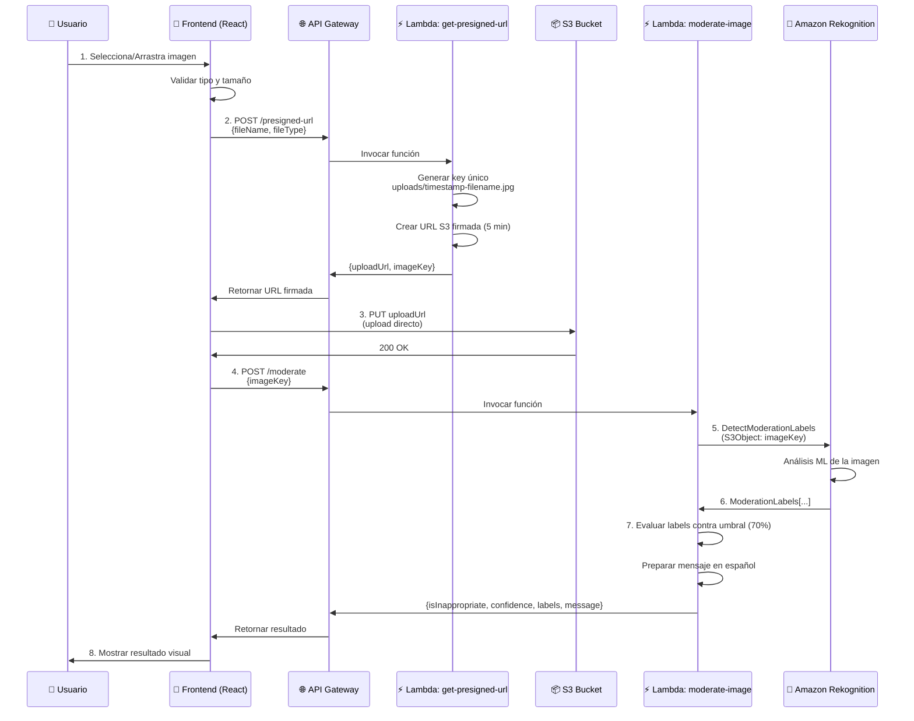

# AGENT.MD - Factum AI: Documentación Completa para Desarrolladores

> **Documento Técnico para Jules y el Equipo de Desarrollo**  
> Esta documentación explica en profundidad la arquitectura, componentes, flujos de datos y todo lo necesario para entender y trabajar con el proyecto Factum AI.

---

## 📋 Tabla de Contenidos

1. [Visión General del Proyecto](#-visión-general-del-proyecto)
2. [Arquitectura del Sistema](#-arquitectura-del-sistema)
3. [Estructura del Proyecto](#-estructura-del-proyecto)
4. [Frontend - Aplicación React](#-frontend---aplicación-react)
5. [Backend - Funciones Lambda](#-backend---funciones-lambda)
6. [Flujo de Datos Completo](#-flujo-de-datos-completo)
7. [Servicios de AWS](#-servicios-de-aws)
8. [Configuración y Variables de Entorno](#-configuración-y-variables-de-entorno)
9. [Proceso de Despliegue](#-proceso-de-despliegue)
10. [Seguridad y Mejores Prácticas](#-seguridad-y-mejores-prácticas)
11. [Troubleshooting y Debugging](#-troubleshooting-y-debugging)

---

## 🎯 Visión General del Proyecto

**Factum AI** es un sistema de **moderación de contenido multimedia** que utiliza **inteligencia artificial** para detectar contenido inapropiado o explícito en imágenes.

### ¿Qué Hace?

1. Un usuario sube una imagen a través de una interfaz web moderna (React)
2. La imagen se almacena temporalmente en AWS S3
3. Amazon Rekognition analiza la imagen usando machine learning
4. El sistema retorna un resultado indicando si la imagen contiene contenido inapropiado

### Stack Tecnológico Principal

```
Frontend:  React 19 + Vite + TailwindCSS
Backend:   AWS Lambda (Node.js) + API Gateway
Storage:   AWS S3
AI/ML:     Amazon Rekognition
```

### Casos de Uso

- ✅ Moderación de contenido generado por usuarios en redes sociales
- ✅ Filtrado de imágenes en plataformas de e-commerce
- ✅ Protección de comunidades online
- ✅ Cumplimiento normativo (COPPA, GDPR, etc.)

---

## 🏗️ Arquitectura del Sistema

### Diagrama de Arquitectura

La arquitectura sigue un patrón **serverless** con separación clara entre frontend y backend:

```
┌─────────────────────────────────────────────────────────────────┐
│                        USUARIO                                  │
│                     (Navegador Web)                             │
└────────────────────────┬────────────────────────────────────────┘
                         │
                         ▼
┌─────────────────────────────────────────────────────────────────┐
│                    FRONTEND (React App)                         │
│  ┌──────────────────────────────────────────────────────┐      │
│  │  • ImageUploader Component                            │      │
│  │  • ModerationResult Component                         │      │
│  │  • apiService (HTTP Client)                           │      │
│  └──────────────────────────────────────────────────────┘      │
└────────────────┬────────────────────────┬───────────────────────┘
                 │                        │
                 ▼                        ▼
    ┌────────────────────┐    ┌──────────────────────┐
    │  AWS API Gateway   │    │     AWS S3 Bucket    │
    │  (REST Endpoints)  │    │  (Image Storage)     │
    └─────────┬──────────┘    └──────────────────────┘
              │                          ▲
              ▼                          │
    ┌─────────────────────┐             │
    │  Lambda Functions   │─────────────┘
    ├─────────────────────┤
    │ 1. get-presigned-url│──► Genera URLs firmadas para S3
    │ 2. moderate-image   │──► Analiza imagen con Rekognition
    └──────────┬──────────┘
               │
               ▼
    ┌──────────────────────┐
    │ Amazon Rekognition   │
    │ (Content Moderation) │
    └──────────────────────┘
```

### Flujo de Alto Nivel

1. **Solicitud de Upload**: Usuario selecciona imagen → Frontend pide URL firmada
2. **Upload Directo**: Frontend sube imagen directamente a S3 (sin pasar por backend)
3. **Análisis**: Frontend solicita análisis → Lambda invoca Rekognition
4. **Resultado**: Rekognition retorna labels/confianza → Lambda procesa → Frontend muestra resultado

### Ventajas de Esta Arquitectura

✅ **Escalabilidad**: Lambda escala automáticamente según demanda  
✅ **Costos**: Pay-per-use, no servidores siempre corriendo  
✅ **Performance**: Upload directo a S3 reduce latencia  
✅ **Seguridad**: URLs prefirmadas con expiración, IAM roles con permisos mínimos  

---

## 📁 Estructura del Proyecto

```
Factum-AI/
│
├── factum-app/                      # 🎨 FRONTEND - Aplicación React
│   ├── src/
│   │   ├── components/
│   │   │   ├── ImageUploader.jsx    # Componente de carga de imágenes
│   │   │   ├── ImageUploader.css
│   │   │   ├── ModerationResult.jsx # Componente de resultados
│   │   │   └── ModerationResult.css
│   │   │
│   │   ├── services/
│   │   │   └── apiService.js        # Cliente HTTP para API Gateway
│   │   │
│   │   ├── assets/                  # Imágenes, iconos, etc.
│   │   ├── App.jsx                  # Componente raíz de la aplicación
│   │   ├── App.css                  # Estilos principales
│   │   ├── main.jsx                 # Entry point de React
│   │   └── index.css                # Estilos globales
│   │
│   ├── public/                      # Archivos estáticos
│   ├── .env                         # Variables de entorno (NO en git)
│   ├── .env.example                 # Plantilla de variables de entorno
│   ├── package.json                 # Dependencias del frontend
│   ├── vite.config.js               # Configuración de Vite
│   └── README.md
│
├── lambda/                          # ⚡ BACKEND - Funciones AWS Lambda
│   ├── get-presigned-url/
│   │   ├── index.js                 # Generación de URLs S3 firmadas
│   │   └── package.json
│   │
│   └── moderate-image/
│       ├── index.js                 # Análisis de contenido con Rekognition
│       └── package.json
│
├── docs/                            # 📚 DOCUMENTACIÓN
│   ├── AWS_SETUP.md                 # Guía de configuración AWS (paso a paso)
│   └── DEPLOYMENT.md                # Guía de despliegue a producción
│
├── README.md                        # Documentación general del proyecto
└── AGENT.MD                         # 👈 Este documento
```

---

## 🎨 Frontend - Aplicación React

### Tecnologías y Dependencias

```json
{
  "react": "^19.2.0",                    // Framework UI
  "react-dom": "^19.2.0",                // React DOM bindings
  "react-dropzone": "^14.3.5",           // Drag & drop de archivos
  "axios": "^1.7.9",                     // Cliente HTTP
  "@aws-sdk/client-s3": "^3.699.0",      // SDK S3 para upload directo
  "vite": "^7.2.4"                       // Build tool y dev server
}
```

### Componentes Principales

#### 1. **App.jsx** - Componente Raíz

**Responsabilidades:**
- Manejo del estado global de la aplicación
- Orquestación de la carga y análisis de imágenes
- Gestión de errores

**Estado Manejado:**
```javascript
const [currentImageKey, setCurrentImageKey] = useState(null);     // S3 key de la imagen
const [currentImageName, setCurrentImageName] = useState(null);   // Nombre original
const [moderationResult, setModerationResult] = useState(null);   // Resultado del análisis
const [isAnalyzing, setIsAnalyzing] = useState(false);            // Loading state
const [error, setError] = useState(null);                         // Mensajes de error
```

**Funciones Clave:**

- `handleUploadComplete(imageKey, imageName)`: Se ejecuta cuando la imagen se sube exitosamente a S3
  - Guarda la key y nombre de la imagen
  - Llama a `moderateImage()` del servicio API
  - Actualiza el estado según el resultado

- `handleUploadError(errorMessage)`: Maneja errores durante la carga

- `handleReset()`: Reinicia el estado para analizar otra imagen

#### 2. **ImageUploader.jsx** - Componente de Carga

**Responsabilidades:**
- Interfaz drag & drop para selección de archivos
- Validación de tipo y tamaño de archivo
- Upload a S3 usando URL prefirmada
- Feedback visual del progreso

**Flujo de Upload:**

```javascript
// 1. Usuario selecciona/arrastra archivo
onDrop(acceptedFiles) {
  // 2. Validaciones
  - Tipo: debe ser image/*
  - Tamaño: máximo 10MB
  
  // 3. Mostrar preview de la imagen
  const reader = new FileReader();
  reader.readAsDataURL(file);
  
  // 4. Solicitar URL prefirmada
  const { uploadUrl, imageKey } = await getPresignedUrl(file.name, file.type);
  
  // 5. Upload directo a S3
  await uploadToS3(uploadUrl, file);
  
  // 6. Notificar al componente padre
  onUploadComplete(imageKey, file.name);
}
```

**Características UX:**
- ✨ Animaciones de drag-over
- 📊 Barra de progreso de upload (0% → 100%)
- 🖼️ Preview de la imagen antes/durante upload
- ⚠️ Mensajes de error descriptivos

#### 3. **ModerationResult.jsx** - Resultados del Análisis

**Responsabilidades:**
- Mostrar si la imagen es segura o inapropiada
- Visualizar nivel de confianza con barra de progreso
- Listar etiquetas de moderación detectadas (opcional, colapsable)
- Botón para analizar otra imagen

**Datos Recibidos:**
```javascript
{
  isInappropriate: true/false,           // Clasificación principal
  confidence: 85.5,                      // % de confianza del label principal
  labels: [                              // Todas las etiquetas detectadas
    { Name: "Explicit Nudity", Confidence: 95.2, ParentName: "Nudity" },
    { Name: "Graphic Content", Confidence: 88.7, ParentName: null }
  ],
  message: "Descripción en español del resultado",
  threshold: 70                          // Umbral usado (70%)
}
```

**Estados Visuales:**
- ✅ **Seguro**: Fondo verde, ícono de check
- ⚠️ **Inapropiado**: Fondo rojo/naranja, ícono de advertencia

### Capa de Servicios

#### **apiService.js** - Cliente HTTP

Centraliza todas las llamadas a AWS API Gateway:

```javascript
const API_BASE_URL = import.meta.env.VITE_API_GATEWAY_URL;

// 1. Obtener URL prefirmada para upload
export const getPresignedUrl = async (fileName, fileType) => {
  const response = await axios.post(`${API_BASE_URL}/presigned-url`, {
    fileName,
    fileType
  });
  return response.data; // { uploadUrl, imageKey, expiresIn }
}

// 2. Upload directo a S3
export const uploadToS3 = async (presignedUrl, file) => {
  await axios.put(presignedUrl, file, {
    headers: { 'Content-Type': file.type }
  });
}

// 3. Solicitar análisis de moderación
export const moderateImage = async (imageKey) => {
  const response = await axios.post(`${API_BASE_URL}/moderate`, {
    imageKey
  });
  return response.data;
}
```

### Configuración de Vite

**vite.config.js:**
```javascript
import { defineConfig } from 'vite'
import react from '@vitejs/plugin-react'

export default defineConfig({
  plugins: [react()],
  server: {
    port: 5173,
    host: true
  }
})
```

---

## ⚡ Backend - Funciones Lambda

### Lambda 1: `get-presigned-url`

**Archivo:** `lambda/get-presigned-url/index.js`

**Propósito:** Generar URLs prefirmadas de S3 para que el frontend pueda hacer upload directo

**Input (JSON):**
```json
{
  "fileName": "vacation.jpg",
  "fileType": "image/jpeg"
}
```

**Output (JSON):**
```json
{
  "uploadUrl": "https://factum-bucket.s3.us-east-2.amazonaws.com/uploads/1703012345678-vacation.jpg?X-Amz-Algorithm=...",
  "imageKey": "uploads/1703012345678-vacation.jpg",
  "expiresIn": 300
}
```

**Lógica Principal:**

```javascript
// 1. Parse del body
const { fileName, fileType } = JSON.parse(event.body);

// 2. Validaciones
if (!fileType.startsWith('image/')) {
  return error(400, 'Only image files allowed');
}

// 3. Generar key único
const timestamp = Date.now();
const sanitizedFileName = fileName.replace(/[^a-zA-Z0-9.-]/g, '_');
const imageKey = `uploads/${timestamp}-${sanitizedFileName}`;

// 4. Crear comando S3 PutObject
const command = new PutObjectCommand({
  Bucket: BUCKET_NAME,
  Key: imageKey,
  ContentType: fileType
});

// 5. Generar URL firmada (válida por 5 minutos)
const uploadUrl = await getSignedUrl(s3Client, command, { expiresIn: 300 });

return success({ uploadUrl, imageKey, expiresIn: 300 });
```

**Configuración AWS:**
- **Runtime:** Node.js 20.x
- **Handler:** index.handler
- **Timeout:** 10 segundos
- **Memoria:** 256 MB
- **Permisos IAM:** `s3:PutObject` en el bucket específico

**Manejo CORS:**
```javascript
const headers = {
  'Access-Control-Allow-Origin': '*',           // En producción: dominio específico
  'Access-Control-Allow-Headers': 'Content-Type',
  'Access-Control-Allow-Methods': 'POST, OPTIONS'
};
```

### Lambda 2: `moderate-image`

**Archivo:** `lambda/moderate-image/index.js`

**Propósito:** Analizar imagen en S3 usando Amazon Rekognition

**Input (JSON):**
```json
{
  "imageKey": "uploads/1703012345678-vacation.jpg"
}
```

**Output (JSON):**
```json
{
  "isInappropriate": false,
  "confidence": 12.5,
  "labels": [
    {
      "Name": "Revealing Clothes",
      "Confidence": 12.5,
      "ParentName": "Suggestive"
    }
  ],
  "message": "La imagen es segura. No se detectó contenido inapropiado.",
  "threshold": 70
}
```

**Lógica Principal:**

```javascript
// 1. Parse del body
const { imageKey } = JSON.parse(event.body);

// 2. Invocar Rekognition
const command = new DetectModerationLabelsCommand({
  Image: {
    S3Object: {
      Bucket: BUCKET_NAME,
      Name: imageKey
    }
  },
  MinConfidence: 60  // Retornar labels con confianza >= 60%
});

const response = await rekognitionClient.send(command);
const moderationLabels = response.ModerationLabels || [];

// 3. Evaluar labels contra categorías explícitas
const EXPLICIT_CATEGORIES = [
  'Explicit Nudity',
  'Nudity',
  'Graphic Male Nudity',
  'Graphic Female Nudity',
  'Sexual Activity',
  'Illustrated Explicit Nudity',
  'Adult Toys'
];

let isInappropriate = false;
let maxConfidence = 0;

for (const label of moderationLabels) {
  if (label.Confidence > maxConfidence) {
    maxConfidence = label.Confidence;
  }
  
  // Si algún label explícito supera el umbral → inapropiado
  if (EXPLICIT_CATEGORIES.includes(label.Name) && label.Confidence >= 70) {
    isInappropriate = true;
  }
}

// 4. Preparar mensaje en español
const message = isInappropriate 
  ? `Se detectó contenido inapropiado con ${maxConfidence.toFixed(1)}% de confianza.`
  : 'La imagen es segura. No se detectó contenido inapropiado.';

return success({
  isInappropriate,
  confidence: maxConfidence,
  labels: moderationLabels,
  message,
  threshold: 70
});
```

**Configuración AWS:**
- **Runtime:** Node.js 20.x
- **Handler:** index.handler
- **Timeout:** 30 segundos (Rekognition puede tardar)
- **Memoria:** 512 MB
- **Permisos IAM:** 
  - `s3:GetObject` en el bucket
  - `rekognition:DetectModerationLabels`

---

## 🔄 Flujo de Datos Completo

### Secuencia Detallada



### Tiempos Estimados por Paso

| Paso | Acción | Tiempo Estimado |
|------|--------|-----------------|
| 1-2  | Validación local + solicitar URL | 100-300ms |
| 3    | Upload a S3 | 500ms - 3s (según tamaño) |
| 4-5  | Invocar Lambda + Rekognition | 1-3s |
| 6-8  | Procesar y mostrar resultado | 200-500ms |
| **TOTAL** | **Flujo completo** | **~3-7 segundos** |

---

## ☁️ Servicios de AWS

### 1. Amazon S3 (Simple Storage Service)

**Propósito:** Almacenar imágenes subidas por usuarios

**Configuración del Bucket:**

```json
{
  "BucketName": "factum-content-moderation",
  "Region": "us-east-2",
  "Versioning": "Disabled",
  "PublicAccess": "Blocked",
  "Encryption": "AES256"
}
```

**Política CORS:**

```json
[
  {
    "AllowedHeaders": ["*"],
    "AllowedMethods": ["PUT", "POST"],
    "AllowedOrigins": [
      "http://localhost:5173",
      "https://tu-dominio.com"
    ],
    "ExposeHeaders": ["ETag"],
    "MaxAgeSeconds": 3000
  }
]
```

**Lifecycle Policy (Limpieza Automática):**

```json
{
  "Rules": [
    {
      "Id": "DeleteOldUploads",
      "Status": "Enabled",
      "Prefix": "uploads/",
      "Expiration": {
        "Days": 7
      }
    }
  ]
}
```

### 2. AWS Lambda

**Costos Aproximados:**
- Primeros 1M requests/mes: GRATIS
- Después: $0.20 por millón de requests
- Compute: $0.0000166667 por GB-segundo

**Ejemplo:** 10,000 requests/mes con 512MB RAM y 2s promedio = **~$0.50/mes**

### 3. Amazon API Gateway

**Propósito:** Exponer endpoints HTTP para el frontend

**Configuración:**

```
API Type: HTTP API (más económico que REST API)
Region: us-east-2 (misma región que S3 y Lambda)

Endpoints:
  POST /presigned-url → Lambda: get-presigned-url
  POST /moderate       → Lambda: moderate-image

CORS: Habilitado
Throttling: 10,000 requests/segundo (default)
```

**URL de Producción:**
```
https://abc123xyz.execute-api.us-east-2.amazonaws.com/prod
```

### 4. Amazon Rekognition

**Propósito:** Detección de contenido inapropiado usando ML

**Método Usado:** `DetectModerationLabels`

**Categorías Detectadas:**
- Explicit Nudity (desnudez explícita)
- Suggestive (contenido sugestivo)
- Violence (violencia)
- Visually Disturbing (contenido perturbador)
- Rude Gestures (gestos obscenos)
- Drugs (drogas)
- Tobacco (tabaco)
- Alcohol (alcohol)
- Gambling (apuestas)
- Hate Symbols (símbolos de odio)

**Costos:**
- Primeros 5,000 imágenes/mes: GRATIS (primer año)
- Después: $1.00 por 1,000 imágenes

### 5. AWS CloudWatch

**Propósito:** Logs, métricas y monitoreo

**Logs Generados:**
- `/aws/lambda/factum-get-presigned-url`
- `/aws/lambda/factum-moderate-image`

**Métricas Clave:**
- Invocaciones por minuto
- Duración promedio
- Errores (4xx, 5xx)
- Throttles

---

## ⚙️ Configuración y Variables de Entorno

### Frontend (.env)

**Ubicación:** `factum-app/.env`

```env
# URL base de API Gateway
VITE_API_GATEWAY_URL=https://abc123xyz.execute-api.us-east-2.amazonaws.com/prod

# Región de AWS
VITE_AWS_REGION=us-east-2

# Nombre del bucket S3
VITE_S3_BUCKET_NAME=factum-content-moderation
```

> **⚠️ IMPORTANTE:** El archivo `.env` NO debe estar en git. Usar `.env.example` como plantilla.

**Acceso en React:**
```javascript
const apiUrl = import.meta.env.VITE_API_GATEWAY_URL;
```

### Backend (Lambda)

**Variables de Entorno por Función:**

**get-presigned-url:**
```
AWS_REGION=us-east-2
S3_BUCKET_NAME=factum-content-moderation
```

**moderate-image:**
```
AWS_REGION=us-east-2
S3_BUCKET_NAME=factum-content-moderation
```

**Configuración en AWS Console:**
Lambda → Función → Configuration → Environment variables

---

## 🚀 Proceso de Despliegue

### Despliegue del Backend (Lambda)

#### Método 1: Manual desde AWS Console

```powershell
# get-presigned-url
cd lambda/get-presigned-url
npm install --production
Compress-Archive -Path * -DestinationPath function.zip -Force

# Subir function.zip en AWS Lambda Console
```

#### Método 2: AWS CLI (Automatizado)

```powershell
# Script PowerShell: deploy-lambdas.ps1
cd lambda/get-presigned-url
npm install --production
Compress-Archive -Path * -DestinationPath function.zip -Force

aws lambda update-function-code `
    --function-name factum-get-presigned-url `
    --zip-file fileb://function.zip `
    --region us-east-2

Remove-Item function.zip
cd ../..

# Repetir para moderate-image
```

### Despliegue del Frontend

#### Opción 1: Vercel (Recomendado)

```bash
cd factum-app
npm install -g vercel
vercel login
vercel  # Primera vez: configurar proyecto
vercel --prod  # Deploy a producción
```

**Configurar variables en Vercel Dashboard:**
- Settings → Environment Variables
- Agregar: `VITE_API_GATEWAY_URL`, `VITE_AWS_REGION`, `VITE_S3_BUCKET_NAME`

#### Opción 2: AWS S3 + CloudFront

```bash
cd factum-app
npm run build

aws s3 mb s3://factum-app-frontend --region us-east-2

aws s3 sync dist/ s3://factum-app-frontend --acl public-read

aws s3 website s3://factum-app-frontend \
    --index-document index.html \
    --error-document index.html
```

### Verificación Post-Despliegue

```bash
# Test Lambda 1
aws lambda invoke \
    --function-name factum-get-presigned-url \
    --payload '{"body":"{\"fileName\":\"test.jpg\",\"fileType\":\"image/jpeg\"}"}' \
    response.json

cat response.json

# Test desde frontend
curl -X POST https://tu-api.execute-api.us-east-2.amazonaws.com/prod/presigned-url \
  -H "Content-Type: application/json" \
  -d '{"fileName":"test.jpg","fileType":"image/jpeg"}'
```

---

## 🔒 Seguridad y Mejores Prácticas

### Seguridad Implementada

✅ **URLs Prefirmadas con Expiración**
- URLs válidas solo por 5 minutos
- Previene uploads no autorizados

✅ **CORS Configurado**
- Solo orígenes permitidos pueden hacer requests
- En producción: cambiar `*` por dominio específico

✅ **Validación de Tipos de Archivo**
- Frontend y Lambda validan que sea `image/*`
- Previene uploads de ejecutables/scripts

✅ **Límite de Tamaño**
- Frontend: 10MB máximo
- S3: Se puede configurar bucket policy adicional

✅ **IAM Roles de Mínimo Privilegio**
```json
{
  "Version": "2012-10-17",
  "Statement": [
    {
      "Effect": "Allow",
      "Action": "s3:PutObject",
      "Resource": "arn:aws:s3:::factum-content-moderation/uploads/*"
    },
    {
      "Effect": "Allow",
      "Action": "s3:GetObject",
      "Resource": "arn:aws:s3:::factum-content-moderation/uploads/*"
    },
    {
      "Effect": "Allow",
      "Action": "rekognition:DetectModerationLabels",
      "Resource": "*"
    }
  ]
}
```

✅ **Lifecycle Policies**
- Las imágenes se eliminan automáticamente después de 7 días
- Reduce costos de almacenamiento y riesgos de privacidad

### Mejoras de Seguridad Recomendadas para Producción

🔐 **Autenticación de Usuarios**
```javascript
// Implementar JWT tokens o AWS Cognito
headers: {
  'Authorization': `Bearer ${token}`
}
```

🔐 **Rate Limiting**
```javascript
// API Gateway: Throttling por API key
- 100 requests por minuto por usuario
- 10,000 requests por día
```

🔐 **Validación de Contenido Adicional**
```javascript
// Verificar dimensiones de imagen
// Verificar que no esté corrupta
// Escaneo de malware (ClamAV)
```

🔐 **Encriptación en Tránsito y en Reposo**
```
- HTTPS obligatorio (API Gateway)
- S3 Server-Side Encryption (SSE-S3 o KMS)
```

---

## 🐛 Troubleshooting y Debugging

### Errores Comunes

#### 1. **Error: CORS Policy**

```
Access to fetch at '...' has been blocked by CORS policy
```

**Solución:**
- Verificar CORS en S3 bucket
- Verificar CORS en API Gateway
- Verificar headers en Lambda responses

**Debug:**
```bash
# Ver configuración CORS en S3
aws s3api get-bucket-cors --bucket factum-content-moderation

# Habilitar CORS en API Gateway
API Gateway → Your API → CORS → Configure
```

#### 2. **Error: AccessDenied al subir a S3**

```
<Error>
  <Code>AccessDenied</Code>
  <Message>Request has expired</Message>
</Error>
```

**Causas:**
- URL prefirmada expiró (>5 minutos)
- Clock skew (reloj del sistema desincronizado)

**Solución:**
```javascript
// Aumentar tiempo de expiración (desarrollo)
expiresIn: 600  // 10 minutos

// Sincronizar reloj del sistema
w32tm /resync
```

#### 3. **Error: "Cannot read properties of undefined"**

**Causa:** Variables de entorno no configuradas

**Solución:**
```bash
# Verificar .env existe
ls factum-app/.env

# Verificar contenido
cat factum-app/.env

# Reiniciar servidor de desarrollo
npm run dev
```

#### 4. **Rekognition retorna labels vacíos**

**Causa:** Imagen demasiado pequeña o borrosa

**Solución:**
```javascript
// Validar resolución mínima
const MIN_WIDTH = 64;
const MIN_HEIGHT = 64;

// Usar MinConfidence más bajo en casos específicos
MinConfidence: 50  // en lugar de 60
```

### Debugging de Lambda Functions

**Ver logs en CloudWatch:**
```bash
aws logs tail /aws/lambda/factum-get-presigned-url --follow
```

**Test local con SAM:**
```bash
sam local invoke get-presigned-url -e events/test-event.json
```

**Habilitar X-Ray para tracing:**
```
Lambda → Configuration → Monitoring tools → X-Ray → Enable
```

### Debugging del Frontend

**Inspeccionar Network Requests:**
```
Chrome DevTools → Network Tab
- Verificar status codes (200, 403, 500)
- Ver request/response bodies
- Verificar headers
```

**Console logs útiles:**
```javascript
console.log('API Base URL:', import.meta.env.VITE_API_GATEWAY_URL);
console.log('Upload response:', response.data);
console.log('Moderation result:', moderationResult);
```

---

## 📊 Métricas y Monitoreo

### CloudWatch Dashboards

**Crear dashboard personalizado:**

```json
{
  "widgets": [
    {
      "type": "metric",
      "properties": {
        "metrics": [
          ["AWS/Lambda", "Invocations", { "stat": "Sum" }],
          ["AWS/Lambda", "Errors", { "stat": "Sum" }],
          ["AWS/Lambda", "Duration", { "stat": "Average" }]
        ],
        "period": 300,
        "stat": "Sum",
        "region": "us-east-2",
        "title": "Lambda Performance"
      }
    }
  ]
}
```

### Alertas Importantes

1. **Lambda Errors > 5 en 5 minutos**
2. **API Gateway 5xx Errors > 10 en 5 minutos**
3. **S3 4xx Errors > 50 en 5 minutos**
4. **Lambda Duration > 25 segundos (near timeout)**

---

## 🎓 Recursos Adicionales

### Documentación Oficial

- [AWS Lambda Developer Guide](https://docs.aws.amazon.com/lambda/)
- [Amazon Rekognition Moderation](https://docs.aws.amazon.com/rekognition/latest/dg/moderation.html)
- [React Documentation](https://react.dev/)
- [Vite Guide](https://vitejs.dev/guide/)

### Archivos de Configuración del Proyecto

- [AWS_SETUP.md](docs/AWS_SETUP.md) - Configuración paso a paso de AWS
- [DEPLOYMENT.md](docs/DEPLOYMENT.md) - Guía completa de despliegue
- [README.md](README.md) - Documentación general del proyecto

---

## 📝 Notas Finales para Jules

### ¿Qué Hace Este Sistema?

Este proyecto es un **moderador de contenido** que usa IA para detectar imágenes inapropiadas. Es como tener un guardia de seguridad automatizado que revisa cada foto antes de permitir que se publique.

### Arquitectura en Términos Simples

1. **React Frontend**: La cara visible, lo que ven los usuarios
2. **AWS Lambda**: El cerebro, procesa las solicitudes sin necesidad de servidores 24/7
3. **S3**: El almacén, guarda las imágenes temporalmente
4. **Rekognition**: El experto en IA, analiza las imágenes
5. **API Gateway**: El portero, controla quién puede entrar y qué puede hacer

### Para Empezar a Desarrollar

```bash
# 1. Clonar el proyecto
git clone https://github.com/T0NY24/Factum-AI.git
cd Factum-AI

# 2. Instalar frontend
cd factum-app
npm install

# 3. Configurar .env (pedir valores al equipo)
cp .env.example .env
# Editar .env con los valores reales

# 4. Correr en desarrollo
npm run dev
# Abre http://localhost:5173
```

### Modificaciones Comunes

**Cambiar el umbral de detección:**
```javascript
// lambda/moderate-image/index.js
const CONFIDENCE_THRESHOLD = 70; // Cambiar a 80 para ser más estricto
```

**Agregar nuevas categorías explícitas:**
```javascript
const explicitCategories = [
  'Explicit Nudity',
  'Sexual Activity',
  'Nueva Categoría Aquí'  // Añadir aquí
];
```

**Cambiar tiempo de expiración de URLs:**
```javascript
// lambda/get-presigned-url/index.js
const URL_EXPIRATION = 300; // Segundos (5 minutos)
```

---

**Última actualización:** Diciembre 2024  
**Mantenedores:** T0NY24 y equipo Factum AI  
**Licencia:** MIT
